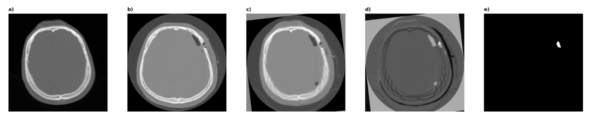

# Burr-Hole Detection (Self-Annotated)

**Prediction of Burr-Hole Placement from Preoperative CT Scans of
Patients with Chronic Subdural Haematoma Using Self-Supervised Learning
from Noisy Labels**\
Černý M., Jirák A., *et al.*

This repository contains the full preprocessing and training pipeline
used to generate **self-annotated burr-hole masks** from paired **pre-
and postoperative CT scans** and to train an **nnU-Net-based
segmentation model**.

The method leverages **noisy supervision derived from postoperative bone
defects**, enabling large-scale training without manual annotation.

------------------------------------------------------------------------

# Overview of the Pipeline

The workflow consists of five main stages:

1.  **Rigid registration** of postoperative CT to preoperative CT
2.  **Image subtraction** to highlight postoperative bone defects
3.  **Automatic binarization** to obtain burr-hole candidates
4.  **Morphological filtering / QC metrics**
5.  **Export to nnU-Net format and model training**

------------------------------------------------------------------------

# Expected Folder Structure

Input directory:

    data/
    ├── train/
    │   ├── {CASE_ID}/
    │   │   ├── preop.nii.gz
    │   │   └── postop.nii.gz
    │   ...
    └── test/
        ├── {CASE_ID}/
        │   └── preop.nii.gz
        ...

------------------------------------------------------------------------

# Step-by-Step Usage

## 1. Registration

Rigidly registers **postoperative → preoperative** CT.

``` bash
python register.py {DATASET_PATH}/train
```

Output:

    {DATASET_PATH}/train/{CASE_ID}/postop_to_preop.tfm
    {DATASET_PATH}/train/{CASE_ID}/postop_transformed.nii.gz

------------------------------------------------------------------------

## 2. Subtraction

Computes intensity difference between aligned scans.

``` bash
python subtract.py {DATASET_PATH}/train
```

Output:

    {DATASET_PATH}/train/{CASE_ID}/diff.nii.gz

This volume highlights **postoperative skull defects** corresponding to
burr-holes.

------------------------------------------------------------------------

## 3. Binarization

Automatically segments burr-hole candidates from the subtraction image.

``` bash
python binarize.py {DATASET_PATH}/train
```

Output:

    {DATASET_PATH}/train/{CASE_ID}/burrhole_mask_autoannot.nii.gz

These masks serve as **noisy self-supervised labels**.

------------------------------------------------------------------------

## 4. Morphological Filtering & Quality Metrics

Evaluates connected components and computes **blobbiness / plausibility
metrics**.

``` bash
python filter.py {DATASET_PATH}/train
```

Output:

    {DATASET_PATH}/train/blobbiness.json

Used to:

-   remove implausible detections
-   analyze dataset quality
-   support filtering strategies described in the paper

------------------------------------------------------------------------

## 5. Export for nnU-Net

Converts dataset into **nnU-Net v2** structure.

``` bash
python export_for_nnunet.py {DATASET_PATH} {NNUNET_RAW_DATASET_PATH}
```

------------------------------------------------------------------------

# Model Training (nnU-Net v2)

## Planning & preprocessing

``` bash
nnUNetv2_plan_and_preprocess -d {DATASET_ID} -c 3d_fullres --verify_dataset_integrity
```

## Training

``` bash
nnUNetv2_train {DATASET_ID} 3d_fullres all
```

------------------------------------------------------------------------

# Methodological Concept

Key idea:

> **Postoperative burr-holes act as natural labels**
> allowing self-supervised learning of **optimal surgical entry points**
> from **preoperative CT alone**.

Advantages:

-   no manual annotation required
-   scalable to large retrospective cohorts
-   directly grounded in real surgical outcomes

------------------------------------------------------------------------

# Citation

If you use this code or dataset, please cite:

    Černý M., Jirák A., et al.
    Prediction of Burr-Hole Placement from Preoperative CT Scans of Patients
    with Chronic Subdural Haematoma Using Self-Supervised Learning from Noisy Labels.

*(Full citation will be added after publication.)*

------------------------------------------------------------------------

# License

License specification here...

------------------------------------------------------------------------

# Contact

**Martin Černý, MD, PhD**\
Department of Neurosurgery and Neurooncology\
Military University Hospital\
Prague, Czech Republic

GitHub Issues are the preferred way to report bugs or request features.
